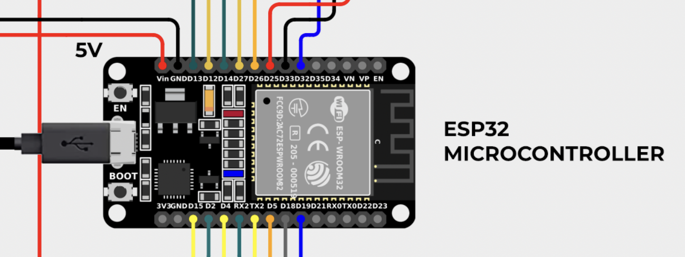
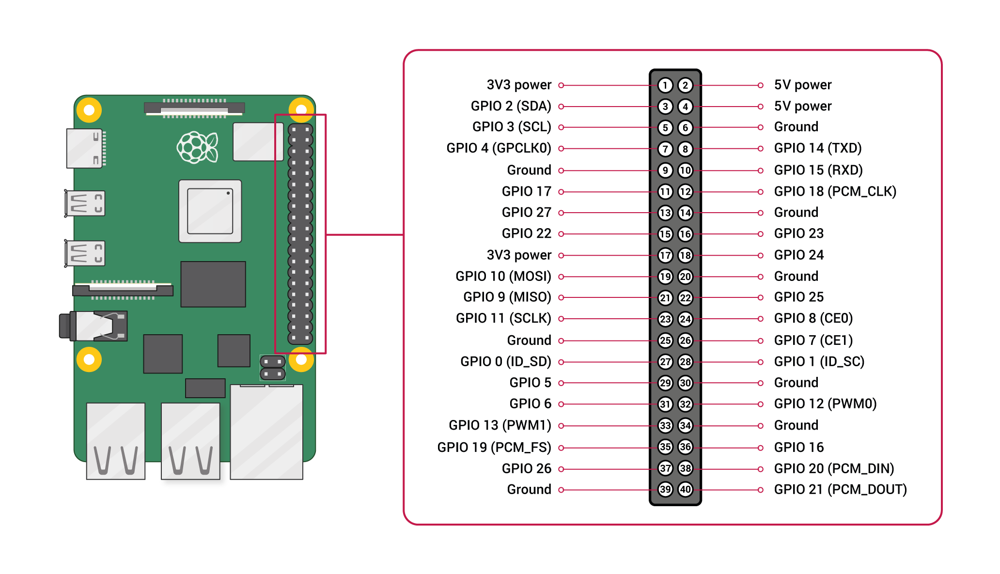
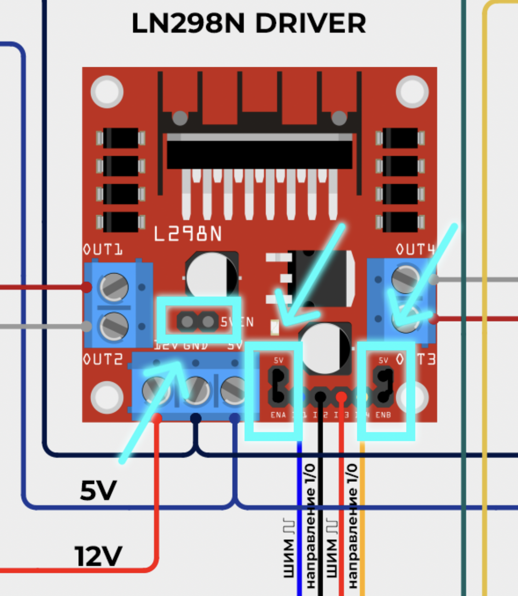
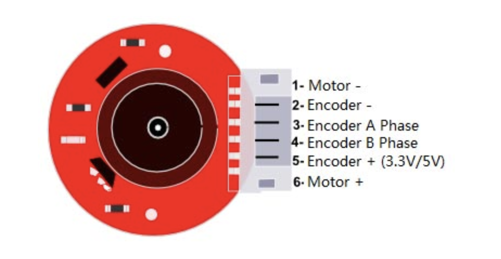

# Инструкция по сборке и пайке электрической схемы мобильного робота

## 1. Введение
В данной инструкции подробно описан процесс сборки и пайки схемы мобильного робота на базе микроконтроллера **ESP32**, с использованием **двигателей с энкодерами**, **драйверов L298N**, **ультразвукового дальномера**, **акселерометра и гироскопа**, а также взаимодействия с **Raspberry Pi**. Рассмотрены электрические подключения, протоколы связи, основы работы компонентов и принципы управления двигателями.
<p align="center">
  
</p>

---

## 2. Компоненты схемы

### 2.1 ESP32
<p align="center">
  
</p>

- **Назначение:** Основной микроконтроллер, отвечающий за управление ходовой частью нашего робота.
- **Особенности:**
  - Поддержка Wi-Fi и Bluetooth
  - GPIO-пины с возможностью прерываний
  - Поддержка ШИМ (PWM)
- **Питание:** 5В - от DC/DC преобразователя LM2596 на пин VIN Esp32


### 2.2 Raspberry Pi
<p align="center">
  
</p>

- **Назначение:** Высокоуровневое управление, передача изображений, анализ данных, мозг нашего робота на котором работает ROS2
- **Особенности:**
  - Работа под Linux (Ubuntu 22.04), что позволяет развернуть ROS2
  - Имеет GPIO для подключения I2C, UART и других интерфейсов, а также usb мышек клавиатуи и даже лидара
  - Общается с ESP32 по usb
- **Питание:** 5В - от DC/DC преобразователя LM2596 на пин VIN Esp32

### 2.3 Драйвера моторов L298N (2 шт.)
<p align="center">
  
</p>

- **Назначение:** Управление направлением и скоростью вращения моторов
- **Принцип работы:** Используют **ШИМ (PWM)** сигналы и цифровые входы для направления
- **Питание:** 5В логика, до 12В для моторов
> **!!!ВАЖНО!!!** — обязательно установи перемычики выделенные на рисунке, они нужны для активации ШИМ и включения 5V стабилизатора для питания логики микросхемы драйвера. 
### 2.4 DC моторы с энкодерами (4 шт.)
<p align="center">
  
</p>

- **Назначение:** Привод робота и обратная связь по положению/скорости
- **Питание энкодеров:** от 5V-вольтового стабилизатора на драйвере LN298N
- **Энкодеры:**
  - магнитные
  - Подключаются к пинам прерываний ESP32
  - Генерируют импульсы при вращении вала

### 2.5 Ультразвуковой дальномер (HC-SR04)
- **Назначение:** Измерение расстояния до препятствий
- **Протокол:** Работа через GPIO (Trigger и Echo)

### 2.6 MPU-6050 (Гироскоп и акселерометр)
- **Протокол связи:** I2C (SCL и SDA)
- **Назначение:** Определение угла наклона и ускорения

### 2.7 Батарейный отсек с Li-Ion аккумуляторами
- **Назначение:** Питание всей системы
- **Напряжение:** 7.4В (2 аккумулятора по 3.7В)

---

## 3. Электрические соединения

### 3.1 Подключение драйверов L298N
- **IN1-IN4:** подключаются к цифровым пинам ESP32 (GPIO)
- **ENA/ENB:** подключаются к пинам с PWM для регулировки скорости
- **OUT1-OUT4:** подключаются к моторам
- **VCC:** питание моторов (до 12В)
- **GND:** общий

### 3.2 Подключение энкодеров
- **2 сигнальных провода от каждого мотора** подключаются к GPIO с возможностью прерывания
- **Прерывания ESP32:** позволяют точно считывать импульсы от энкодеров, что необходимо для контроля скорости и положения

### 3.3 Подключение ультразвукового дальномера
- **Trigger:** GPIO ESP32 (на выход)
- **Echo:** GPIO ESP32 (на вход)

### 3.4 MPU-6050 (I2C)
- **SCL -> GPIO 22 (ESP32)**
- **SDA -> GPIO 21 (ESP32)**
- **VCC -> 3.3В**
- **GND -> GND**

### 3.5 Связь с Raspberry Pi
- Возможны варианты:
  - UART (TX/RX)
  - Wi-Fi (MQTT, WebSocket, TCP)

---

## 4. Теория и пояснения

### 4.1 Что такое ШИМ (PWM)?
> **ШИМ** — это способ управления мощностью, подаваемой на нагрузку, путём изменения коэффициента заполнения сигнала.

- **Использование в моторах:**
  - Чем выше коэффициент заполнения, тем выше напряжение на моторе -> выше скорость.

```
Пример: 50% заполнение = полное напряжение подаётся только половину времени
```

### 4.2 Работа энкодеров
> Энкодеры — это датчики, определяющие вращение вала двигателя.

- **Типы:**
  - Оптические
  - Магнитные
- **Сигналы:**
  - A и B — два сигнала со сдвигом фазы
  - Позволяют определять направление вращения
- **Подключение к ESP32:** через **пины прерываний**, которые реагируют на изменение сигнала в реальном времени

### 4.3 Пины прерываний на ESP32
> Прерывания позволяют "остановить" выполнение основного кода и мгновенно обработать сигнал

- Поддерживаются **почти все GPIO**
- Используются для:
  - Считывания импульсов энкодера
  - Реакции на внешние события

---

## 5. Пайка компонентов

### 5.1 Подготовка
- Убедитесь, что компоненты и провода чистые
- Используйте паяльник с температурой 300–350 °C

### 5.2 Рекомендации
1. **Залудите** провода перед пайкой
2. Паяйте коротко, чтобы не перегреть компоненты
3. Используйте термоусадку или термоклей для изоляции

### 5.3 Проверка
- Прозвоните соединения мультиметром
- Проверьте отсутствие замыканий между соседними пинами

---

## 6. Заключение
Эта схема является основой для создания интеллектуальной роботизированной платформы с функциями навигации, стабилизации и телеметрии. Грамотное подключение и пайка всех компонентов обеспечат надёжную работу и возможность дальнейшего расширения системы.

---

**Удачной сборки!**

---

Если вы нашли ошибку или у вас есть предложения, пожалуйста, свяжитесь с автором инструкции.
